<p align="left">
  
</p>

<p align="left">
  
  
  
  
  
  
  <br/>
  
  
  
  
  
</p>
ClearText

**Universal, cross-platform document optimization tool** that detects and strips unwanted black borders, scanner artifact margins, and invalid digital overlay shapes from PDFs and standard document images (PNG, JPEG, TIFF).

ClearText runs two independent, purpose-built pipelines:

- **Vector pipeline** — parses the drawing tree of digitally-authored PDFs (via PyMuPDF) to find opaque black rectangles injected as border overlays, and neutralizes them without touching the underlying text streams.
- **Raster pipeline** — uses classical computer vision (OpenCV: darkness masking, contour analysis, edge confirmation) to find and remove solid black scanner-bed margins and side bars from scanned/flattened images.

It's built as a zero-retention SaaS backend: FastAPI for the API layer, Celery + Redis for concurrent background processing, and a hardened validation layer that screens every upload for exploit payloads before it ever reaches a processing pipeline.

## Features

- Dual-pipeline architecture — vector shape analysis for digital PDFs, CV-based extraction for scanned images
- Non-destructive default remediation (background-color masking) with an optional aggressive redaction mode
- Concurrent, multi-page processing via Celery background workers
- Hardened input validation: magic-byte sniffing, PDF exploit screening (JS actions, launch actions, external references), object-graph depth/size limits, decompression-bomb guards
- Zero-retention processing: ephemeral temp workspace, no persistent storage, auto-expiring job results, one-time download links
- Dockerized deployment with a full `docker-compose` stack (API, worker, Redis)

## Architecture

```
cleartext/
├── core/
│   ├── config.py           # centralized settings (limits, thresholds)
│   ├── validation.py       # file sanitization & exploit screening
│   ├── vector_pipeline.py  # PyMuPDF-based digital PDF cleanup
│   ├── raster_pipeline.py  # OpenCV-based scanned image cleanup
│   └── processor.py        # pipeline router + orchestration
├── api/
│   ├── main.py              # FastAPI app, endpoints
│   └── schemas.py           # pydantic request/response models
├── worker/
│   ├── celery_app.py        # Celery config (Redis broker)
│   └── tasks.py              # async job execution
├── requirements.txt
├── Dockerfile
└── docker-compose.yml
```

See `QUICKSTART.md` for how to get a local development environment running in a few minutes.

## API overview

| Method | Endpoint | Description |
|---|---|---|
| `POST` | `/api/v1/documents` | Upload a document, returns a `job_id` |
| `GET` | `/api/v1/documents/{job_id}` | Poll job status |
| `GET` | `/api/v1/documents/{job_id}/download` | Download cleaned output (one-time) |
| `POST` | `/api/v1/audit/redactions` | **Read-only.** Submit a PDF for a redaction integrity audit |
| `GET` | `/api/v1/audit/redactions/{job_id}` | Poll and retrieve the audit findings report (no file, ever) |
| `POST` | `/api/v1/forensics/revisions` | **Read-only.** Submit a PDF to discover incremental-save revision history |
| `GET` | `/api/v1/forensics/revisions/{job_id}` | Poll and retrieve the revision timeline (structural facts only, no content) |
| `POST` | `/api/v1/forensics/revisions/extract` | **Gated.** Extract one historical revision as a standalone PDF — requires `confirm_ownership=true` |
| `GET` | `/api/v1/forensics/revisions/extract/{job_id}` | Poll a gated extraction job |
| `GET` | `/api/v1/forensics/revisions/extract/{job_id}/download` | Download an extracted revision (one-time) |
| `GET` | `/healthz` | Liveness check |

Interactive API docs are available at `/docs` once the server is running.

## Redaction integrity audit (read-only)

A distinct feature from the border-cleanup pipelines above — it never modifies or returns a document. It answers one question: **did a redaction actually remove the underlying content, or just paint over it?**

Many "redacted" PDFs only draw an opaque box (a vector fill, or a flat-color image) on top of live text — the original content is still fully selectable and extractable underneath. This audit detects that failure mode, plus PDF `/Redact` annotations that were marked but never actually applied (burned in).

- **PDF-only.** Raster images (PNG/JPEG/TIFF) have no text layer to check against, so this endpoint rejects them outright.
- **Never leaks content by default.** Findings report *counts and locations* of hidden text (e.g. "3 words, 24 characters found under this box") without exposing what it says.
- **`reveal_text=True` is an explicit opt-in**, meant only for a document's own owner performing remediation on their own file. When enabled, CRITICAL findings additionally include the actual extracted text found under a failed redaction. Never default this on in a client UI or an unattended/batch flow.
- Zero-retention applies the same way as the cleanup pipelines: the findings report (including any revealed text) is forgotten from the result backend the moment it's fetched once.

See `core/redaction_audit.py` for the full detection logic and safety rationale.

## Revision forensics (discovery read-only; extraction gated)

PDFs can be updated *incrementally* — an editor appends new objects and a fresh trailer with a `/Prev` pointer back to the previous state, rather than rewriting the file. Every earlier state can still be sitting in the raw bytes, fully recoverable, unless the file was later fully re-exported. This is a real, publicly documented technique — it's the mechanism behind several known incidents where "redacted" documents turned out to still contain prior, unredacted content because they were edited in place.

This feature is deliberately split the same way the redaction audit is:

- **Discovery is unrestricted and read-only.** `POST /api/v1/forensics/revisions` reports how many prior revisions exist, their approximate size, page count, and any timestamps found in each revision's `/Info` dictionary — enough to answer "does this document leak its edit history?" without exposing what any prior revision actually contains.
- **Extraction is a distinct, explicitly-gated action**, not a one-click feature. `POST /api/v1/forensics/revisions/extract` requires `confirm_ownership=true` and is rejected at the API layer (before a job is even queued) if that flag is missing. It's intended only for a document's own custodian confirming — and then properly flattening — content they believed was already removed. Every extraction call is logged.
- Extracted revisions are re-run through the **full** exploit-screening pipeline (`validate_and_sanitize`) before being returned — an old revision can easily contain active content a later save deliberately removed, and recovering it must not resurrect that risk.
- Discovery itself uses a lighter screening pass (`validation.screen_pdf_for_forensics`) that checks for the same malicious-content signals without rebuilding the PDF — a full rebuild would collapse the incremental-save chain this feature exists to find.

See `core/revision_forensics.py` for the full detection logic, the boundary-detection approach (and why a naive `/Prev`-offset regex parse is unreliable), and the extraction warning.

## Configuration

All tunables live in `core/config.py` and are overridable via environment variables (prefixed `CT_`) — e.g. `CT_MAX_UPLOAD_BYTES`, `CT_VECTOR_DEFAULT_MODE`, `CT_RASTER_DEFAULT_MODE`, `CT_JOB_TTL_SECONDS`. See that file for the full list and defaults.

## Security model

- Every upload is magic-byte sniffed (never trusts the client's `Content-Type` header)
- PDFs are screened for `/JavaScript`, `/JS`, `/Launch`, `/OpenAction`, `/EmbeddedFile`, `/GoToR`, and similar active-content vectors via a fast raw-byte scan, then structurally rebuilt through `pikepdf` before processing
- `/AA` (Additional Actions — e.g. "jump to page 3 on open") is evaluated structurally rather than blocked outright: it's extremely common in ordinary Acrobat/Word exports and fillable forms for benign navigation triggers. `validation.py` walks every `/AA` dictionary in the document (root, pages, annotations, form fields, following `/Next` action chains) and only rejects the document when one of those actions actually resolves to a dangerous subtype (`JavaScript`, `Launch`, `SubmitForm`, `ImportData`, `GoToR`, `GoToE`) — including cases where the action is hidden inside a compressed object stream and wouldn't be visible to a raw-byte scan at all.
- Images are decoded under a hard pixel-count ceiling to guard against decompression bombs
- Processing happens in an ephemeral temp workspace that is shredded on exit regardless of success or failure
- Job results auto-expire (`CT_JOB_TTL_SECONDS`) and are forgotten immediately after a single download

## Production notes

- The default Redis-backed result store is fine for development; for production with sensitive documents, swap it for a short-TTL encrypted object store (e.g. S3 + SSE-KMS + a lifecycle rule of minutes) — see the note in `worker/tasks.py`.
- Detection thresholds in `core/config.py` are sane defaults, not calibrated against a real document corpus — tune `VECTOR_*` and `RASTER_*` settings against your actual traffic before relying on them at scale.
- `vector_mode="redact"` is genuinely destructive if a flagged shape overlaps real content. Treat it as an opt-in, confirmed action in your product UI rather than a casual default.

## License

MIT License — see [LICENSE](./LICENSE) for details.
